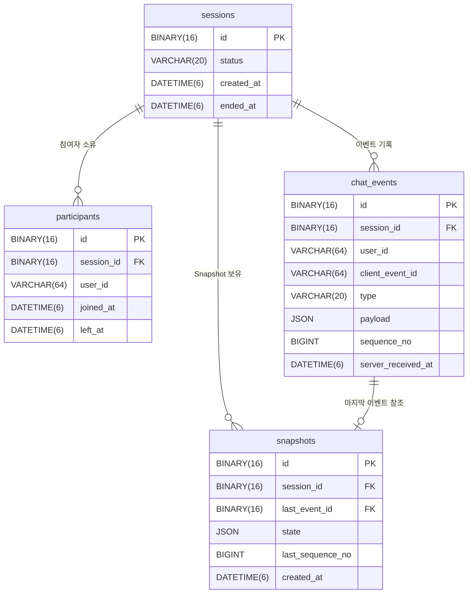

# Creative Digital Lab — 백엔드 사전 과제

1:1 실시간 채팅 + Event Sourcing 기반 상태 복원 서비스

---

## 목차

1. [실행 방법](#실행-방법)
2. [API 명세](#api-명세)
3. [아키텍처](#아키텍처)
4. [ERD](#erd)
5. [주요 의사결정](#주요-의사결정)
6. [WebSocket 시나리오](#websocket-시나리오)
7. [수평 확장 전략](#수평-확장-전략)
8. [장애 대응 시나리오](#장애-대응-시나리오)
9. [쿼리 최적화](#쿼리-최적화)
10. [비목표 / 알려진 한계](#비목표--알려진-한계)

---

## 실행 방법

### 사전 요구사항

- Docker & Docker Compose
- Java 17
- Gradle (Wrapper 포함)

### 1. 인프라 기동

```bash
docker compose up -d
```

MySQL 8.0 (3306), Redis 7 (6379)가 기동됩니다.

### 2. 애플리케이션 기동

```bash
./gradlew bootRun
```

기동 시 `db/schema.sql`이 자동 실행되어 테이블이 생성됩니다.

### 3. 확인

| URL | 설명 |
|-----|------|
| `http://localhost:8080/swagger-ui.html` | OpenAPI 문서 |
| `http://localhost:8080/actuator/health` | 헬스체크 |

---

## API 명세

### Session

| 메서드 | 경로 | 설명 | 응답 코드 |
|--------|------|------|-----------|
| `POST` | `/sessions` | 세션 생성 | 201 |
| `GET` | `/sessions` | 세션 목록 (페이지네이션) | 200 |
| `GET` | `/sessions/{id}` | 세션 단건 조회 | 200 |
| `POST` | `/sessions/{id}/participants` | 세션 참여 | 200 |
| `DELETE` | `/sessions/{id}` | 세션 종료 | 200 |

### Event

| 메서드 | 경로 | 설명 | 응답 코드 |
|--------|------|------|-----------|
| `POST` | `/sessions/{id}/events` | 이벤트 수집 (멱등) | 200 |
| `GET` | `/sessions/{id}/events` | 이벤트 기간 조회 | 200 |

### Timeline

| 메서드 | 경로 | 설명 | 응답 코드 |
|--------|------|------|-----------|
| `GET` | `/sessions/{id}/timeline?at=` | 특정 시점 상태 복원 | 200 |

`at` 파라미터: ISO 8601 형식 (`2026-01-01T12:00:00`)

### WebSocket (STOMP)

연결 엔드포인트: `ws://localhost:8080/ws` (SockJS 폴백 지원)

| 방향 | 경로 | 설명 |
|------|------|------|
| 클라이언트 → 서버 | `/app/sessions/{id}/events` | 이벤트 전송 |
| 클라이언트 → 서버 | `/app/sessions/{id}/reconnect` | 재연결 + 누락 이벤트 요청 |
| 클라이언트 → 서버 | `/app/sessions/{id}/heartbeat` | Presence 갱신 |
| 서버 → 전체 | `/topic/sessions/{id}` | 이벤트 브로드캐스트 |
| 서버 → 개인 | `/user/queue/missed` | 누락 이벤트 재전송 |

---

## 아키텍처

### 패키지 구조

```
com.creatived.chat
├── domain          # 순수 Java. 외부 의존 없음
│   ├── session     # Session, Participant, SessionRepository (인터페이스)
│   ├── event       # ChatEvent, EventType, ChatEventRepository (인터페이스)
│   └── snapshot    # SessionState, Snapshot, EventProjector, SnapshotRepository (인터페이스)
├── application     # 유즈케이스 조합. domain에만 의존
│   ├── session     # SessionApplicationService
│   ├── event       # EventApplicationService
│   ├── snapshot    # SnapshotApplicationService, SnapshotEventListener
│   └── support     # @UseCase, @Idempotent, AOP Aspects
├── infrastructure  # domain 인터페이스 구현. Spring, JPA, Redis 의존
│   ├── persistence # JpaEntity, JpaRepository, RepositoryAdapter
│   ├── redis       # IdempotencyKeyStore, PresenceStore
│   └── config      # WebSocketConfig, AsyncConfig, SwaggerConfig
└── presentation    # HTTP / WebSocket 진입점
    ├── rest        # Controllers, GlobalExceptionHandler
    └── websocket   # ChatWebSocketHandler
```

### 레이어 의존 방향

```
Presentation → Application → Domain ← Infrastructure
```

Domain은 어떤 외부 기술에도 의존하지 않습니다. Infrastructure가 Domain의 Repository 인터페이스를 구현합니다.

---

## ERD



---

## 주요 의사결정

### 1. Event Sourcing — Append-only 이벤트 로그

`chat_events` 테이블은 UPDATE/DELETE를 허용하지 않습니다. 상태 변경은 새 이벤트 추가로만 표현합니다.

**이유**: 이벤트 로그의 불변성이 타임라인 복원의 정확성을 보장합니다. 과거 시점의 상태를 언제든 재현할 수 있습니다.

### 2. 이벤트 정렬 기준 — 서버 수신 시각 우선

정렬 1순위: `server_received_at ASC` / 2순위: `sequence_no ASC`

클라이언트 시계는 기기마다 편차가 있으므로 정렬 기준으로 사용하지 않습니다. 서버가 수신한 시각을 1순위로 하고, 동일 시각 이벤트는 클라이언트가 제공한 `sequence_no`로 순서를 결정합니다.

### 3. Idempotency — Redis + MySQL 이중 방어

```
클라이언트 요청
  ↓
[1차] Redis: clientEventId 키 존재 여부 확인 (TTL 10분)
  → 존재하면 기존 이벤트 반환 (DB 조회 없음)
  ↓
[2차] MySQL: INSERT IGNORE + UNIQUE(session_id, client_event_id)
  → Redis TTL 만료 후 재요청이 DB에 도달해도 중복 저장 차단
```

Redis 장애 시 1차 방어를 건너뛰고 2차(MySQL)로 폴백합니다. 두 방어 모두 통과해야 이벤트가 저장됩니다.

### 4. Full Replay vs Snapshot + Delta Replay

타임라인 복원(`GET /sessions/{id}/timeline?at=`) 시 두 전략을 자동으로 선택합니다.

```
Snapshot이 없거나 at 이전 Snapshot이 없을 때  → Full Replay
Snapshot이 at 이전에 존재할 때               → Snapshot + Delta Replay
```

응답의 `restoredFrom` 필드로 어떤 전략이 사용되었는지 확인할 수 있습니다.

**Snapshot + Delta의 효과**: 이벤트가 N개 쌓여도 최대 49개(interval-1)의 이벤트만 재생하면 됩니다.

### 5. Snapshot 자동 생성 — 비동기 + AFTER_COMMIT

```java
@TransactionalEventListener(phase = AFTER_COMMIT)
@Async("snapshotTaskExecutor")
```

- `AFTER_COMMIT`: 이벤트 저장 트랜잭션이 커밋된 후에만 실행 → 미완료 트랜잭션 상태가 Snapshot에 포함되지 않음
- `@Async`: Snapshot 생성 지연이 이벤트 수집 응답 시간에 영향을 주지 않음
- 실패 시 WARN 로그만 기록. Snapshot이 없어도 Full Replay로 항상 복원 가능합니다.

### 6. 1:1 정원 제한 — 도메인 레이어에서 강제

```java
// Session.join()
if (activeCount >= 2) throw new SessionCapacityExceededException(id);
```

Controller나 Service가 아닌 도메인 메서드에서 직접 검증합니다. 어느 경로로 join()을 호출해도 정원 초과를 막을 수 있습니다.

### 7. UUID → BINARY(16) 저장

UUID를 문자열(36자)이 아닌 `BINARY(16)`(16바이트)으로 저장합니다. 저장 공간 2배 절약, PK 인덱스 크기 감소, 범위 조회 성능 향상이 목적입니다.

Hibernate 7에서 `@Id` 필드에 `AttributeConverter`를 허용하지 않으므로 `@JdbcTypeCode(SqlTypes.BINARY)`를 사용합니다.

---

## WebSocket 시나리오

### 정상 채팅 흐름

```
Client A                    Server                    Client B
   |                           |                          |
   |-- CONNECT /ws ----------->|                          |
   |-- SUB /topic/sessions/{id}|                          |
   |                           |<-- CONNECT /ws ----------|
   |                           |<-- SUB /topic/sessions/{id}
   |                           |                          |
   |-- SEND /app/.../events -->|                          |
   |   (MESSAGE 이벤트)        |-- DB 저장 완료 ----------|
   |                           |-- BROADCAST ------------>|
   |<------------------------- /topic/sessions/{id} ------|
```

### 재연결 / 누락 이벤트 복구 흐름

```
Client A                    Server
   |                           |
   |  (연결 끊김)              |-- SessionDisconnectEvent
   |                           |-- DISCONNECT 이벤트 수집
   |                           |-- PresenceStore.remove()
   |                           |
   |-- CONNECT /ws ----------->|
   |-- SUB /user/queue/missed->|
   |-- SEND /app/.../reconnect |
   |   resumeFromSequenceNo=42 |
   |                           |-- RECONNECT 이벤트 수집
   |                           |-- findMissed(seqNo > 42)
   |<-- /user/queue/missed ----|  (누락 이벤트 목록 전송)
```

누락 이벤트가 1,000개를 초과하면 마지막 100개만 전송합니다. 클라이언트는 이 경우 전체 상태를 `GET /sessions/{id}/timeline`으로 동기화해야 합니다.

---

## 수평 확장 전략

### 현재 구조 (단일 노드)

Simple Broker는 JVM 내부 메모리에서 동작합니다. 노드가 1개일 때는 문제없지만, 노드를 늘리면 각 노드의 브로커가 분리되어 메시지가 누락됩니다.

### WebSocket 브로커 확장 — RabbitMQ STOMP Relay

```
노드 A ──┐
노드 B ──┼──> RabbitMQ STOMP Relay <── 모든 클라이언트 구독
노드 C ──┘
```

Simple Broker를 RabbitMQ STOMP Relay로 교체하면 노드 수에 관계없이 모든 클라이언트가 동일한 메시지를 수신합니다. Spring의 `StompBrokerRelayMessageHandler`가 RabbitMQ와의 연결을 관리합니다.

```java
// WebSocketConfig 변경 예시
registry.enableStompBrokerRelay("/topic", "/queue")
        .setRelayHost("rabbitmq-host")
        .setRelayPort(61613);
```

### Read Replica 라우팅

읽기 트래픽(타임라인 복원, 이벤트 조회)이 증가할 경우 `@Transactional(readOnly = true)` 메서드를 Read Replica로 라우팅할 수 있습니다.

```
쓰기 요청 (@Transactional)            → Primary DB
읽기 요청 (@Transactional(readOnly))  → Read Replica
```

`DataSourceRoutingAspect` + `AbstractRoutingDataSource` 패턴으로 Application Service의 변경 없이 라우팅을 추가할 수 있습니다.

---

## 장애 대응 시나리오

### 1. Redis 다운

- **Idempotency**: 1차 방어(Redis) 건너뜀 → MySQL UNIQUE 2차 방어로 중복 차단 유지
- **Presence**: heartbeat 저장 실패 → 온라인 상태 갱신 불가. 서비스는 계속 동작하지만 Presence 정보가 부정확해질 수 있음
- **조치**: Redis 복구 후 자동 정상화. Presence는 재연결 시 갱신됨

### 2. MySQL Primary 다운

- 모든 쓰기 요청(이벤트 수집, 세션 생성 등) 실패
- 읽기 요청은 Read Replica가 있을 경우 일부 서빙 가능
- **조치**: MySQL 복구 또는 Replica 승격 후 정상화

### 3. Snapshot 생성 실패

- `SnapshotEventListener`가 WARN 로그를 남기고 종료
- 비즈니스 흐름(이벤트 수집, 채팅)은 완전히 정상 동작
- Snapshot이 없어도 Full Replay로 항상 복원 가능
- **조치**: Snapshot 재생성은 다음 이벤트 수집 시 자동 재시도됨

### 4. WebSocket 연결 끊김 (비정상)

- `SessionDisconnectEvent` 감지 → DISCONNECT 이벤트를 DB에 자동 수집
- PresenceStore에서 해당 유저 키 삭제
- 클라이언트 재연결 시 `resumeFromSequenceNo`를 전달하면 누락 이벤트 수신 가능

### 5. 이벤트 순서 뒤바뀜

- 클라이언트 네트워크 지연으로 이벤트 도달 순서가 뒤바뀌어도, 서버는 수신 시각(`server_received_at`)과 `sequence_no`로 정렬
- 클라이언트 시계는 정렬에 사용하지 않으므로 다기기 환경에서도 일관된 순서 보장

### 6. 중복 이벤트 폭주 (클라이언트 재전송 루프)

- Redis TTL(10분) 내 재요청 → Redis 1차 방어에서 즉시 차단 (DB 조회 없음)
- TTL 만료 후 재전송 → MySQL UNIQUE 위반으로 INSERT IGNORE 처리
- 두 경우 모두 기존 이벤트를 200으로 반환. DB 데이터 오염 없음

---

## 쿼리 최적화

### 1. 타임라인 복원 — `idx_events_session_time`

```sql
-- GET /sessions/{id}/timeline?at=
SELECT * FROM chat_events
WHERE session_id = ? AND server_received_at <= ?
ORDER BY server_received_at ASC, sequence_no ASC;
```

`idx_events_session_time (session_id, server_received_at)`으로 `session_id` 필터 후 `server_received_at` 범위를 인덱스 스캔합니다. 전체 테이블 스캔 없이 해당 세션의 이벤트만 접근합니다.

### 2. Snapshot 조회 — `idx_snapshots_session_time`

```sql
-- 가장 최근 Snapshot 조회
SELECT * FROM snapshots
WHERE session_id = ?
ORDER BY created_at DESC
LIMIT 1;
```

`idx_snapshots_session_time (session_id, created_at DESC)`으로 최신 Snapshot을 인덱스 첫 행에서 바로 읽습니다.

### 3. 누락 이벤트 조회 — `idx_events_session_sequence`

```sql
-- 재연결 시 누락 이벤트
SELECT * FROM chat_events
WHERE session_id = ? AND sequence_no > ?
ORDER BY server_received_at ASC, sequence_no ASC;
```

`idx_events_session_sequence (session_id, sequence_no)`으로 `sequence_no` 범위를 효율적으로 스캔합니다.

---

## 비목표 / 알려진 한계

| 항목 | 설명 |
|------|------|
| 인증/인가 | `userId`는 클라이언트가 제공하는 문자열. 토큰 기반 인증 없음 |
| 메시지 암호화 | 전송/저장 암호화 미적용 |
| 파일/이미지 전송 | 단일 메시지 64KB 제한. 바이너리 전송 미지원 |
| 수평 확장 | Simple Broker는 단일 노드 전제. 다중 노드 시 RabbitMQ STOMP Relay 필요 |
| Read Replica | 단일 DataSource 사용. 구현 없이 설계만 기술 |
| Presence 정확도 | TTL 기반이므로 heartbeat 중단 후 최대 300초까지 온라인으로 표시될 수 있음 |
| 이벤트 삭제 | Append-only 정책으로 삭제 불가. 장기 보관 이벤트 아카이빙 전략 없음 |
