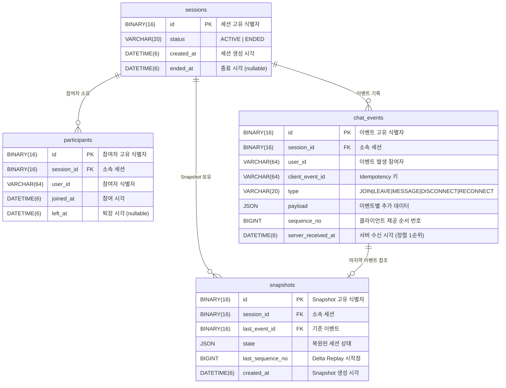

# DB 설계 문서

## ERD

> GitHub, GitLab, Notion 등 Mermaid를 지원하는 환경에서 자동으로 시각화됩니다.
> 로컬 환경에서는 아래 코드 블록을 복사해 [https://mermaid.live](https://mermaid.live) 에 붙여넣으면 ERD를 확인할 수 있습니다.



---

## 핵심 테이블 DDL

```sql
CREATE TABLE IF NOT EXISTS sessions
(
    id         BINARY(16)  NOT NULL PRIMARY KEY COMMENT '세션 고유 식별자',
    status     VARCHAR(20) NOT NULL DEFAULT 'ACTIVE' COMMENT '세션 상태 (ACTIVE | ENDED)',
    created_at DATETIME(6) NOT NULL DEFAULT NOW(6) COMMENT '세션 생성 시각',
    ended_at   DATETIME(6) NULL     COMMENT '세션 종료 시각. ACTIVE 상태일 때 null',
    INDEX idx_sessions_status_created (status, created_at DESC)
) ENGINE = InnoDB DEFAULT CHARSET = utf8mb4;

CREATE TABLE IF NOT EXISTS participants
(
    id         BINARY(16)  NOT NULL PRIMARY KEY COMMENT '참여자 고유 식별자',
    session_id BINARY(16)  NOT NULL COMMENT '소속 세션 식별자',
    user_id    VARCHAR(64) NOT NULL COMMENT '참여자 식별자',
    joined_at  DATETIME(6) NOT NULL DEFAULT NOW(6) COMMENT '세션 참여 시각',
    left_at    DATETIME(6) NULL     COMMENT '세션 퇴장 시각. 참여 중일 때 null',
    CONSTRAINT uq_participant        UNIQUE (session_id, user_id),
    CONSTRAINT fk_participant_session FOREIGN KEY (session_id) REFERENCES sessions (id)
) ENGINE = InnoDB DEFAULT CHARSET = utf8mb4;

CREATE TABLE IF NOT EXISTS chat_events
(
    id                 BINARY(16)  NOT NULL PRIMARY KEY COMMENT '이벤트 고유 식별자',
    session_id         BINARY(16)  NOT NULL COMMENT '소속 세션 식별자',
    user_id            VARCHAR(64) NOT NULL COMMENT '이벤트 발생 참여자',
    client_event_id    VARCHAR(64) NOT NULL COMMENT 'Idempotency 키 (클라이언트 발급)',
    type               VARCHAR(20) NOT NULL COMMENT 'JOIN|LEAVE|MESSAGE|DISCONNECT|RECONNECT',
    payload            JSON        NOT NULL COMMENT '이벤트 타입별 추가 데이터',
    sequence_no        BIGINT      NOT NULL COMMENT '세션 내 순서. server_received_at 동일 시각 tie-break',
    server_received_at DATETIME(6) NOT NULL DEFAULT NOW(6) COMMENT '서버 수신 시각. 정렬 1순위',
    CONSTRAINT uq_event_idempotency UNIQUE (session_id, client_event_id),
    CONSTRAINT fk_event_session     FOREIGN KEY (session_id) REFERENCES sessions (id),
    INDEX idx_events_session_time     (session_id, server_received_at),
    INDEX idx_events_session_sequence (session_id, sequence_no)
) ENGINE = InnoDB DEFAULT CHARSET = utf8mb4;

CREATE TABLE IF NOT EXISTS snapshots
(
    id               BINARY(16)  NOT NULL PRIMARY KEY COMMENT 'Snapshot 고유 식별자',
    session_id       BINARY(16)  NOT NULL COMMENT '소속 세션 식별자',
    last_event_id    BINARY(16)  NULL     COMMENT 'Snapshot 생성 시점의 마지막 이벤트',
    state            JSON        NOT NULL COMMENT '세션 상태 JSON (participants, messages)',
    last_sequence_no BIGINT      NOT NULL COMMENT 'Delta Replay 시작점',
    created_at       DATETIME(6) NOT NULL DEFAULT NOW(6) COMMENT 'Snapshot 생성 시각',
    CONSTRAINT fk_snapshot_session FOREIGN KEY (session_id)    REFERENCES sessions (id),
    CONSTRAINT fk_snapshot_event   FOREIGN KEY (last_event_id) REFERENCES chat_events (id),
    INDEX idx_snapshots_session_time (session_id, created_at DESC)
) ENGINE = InnoDB DEFAULT CHARSET = utf8mb4;
```

---

## 인덱스 설계 근거 (핫패스 중심)

### 핫패스 1 — 타임라인 복원

`GET /sessions/{id}/timeline?at=` 은 가장 빈번하고 비용이 큰 쿼리입니다.

```sql
SELECT * FROM chat_events
WHERE session_id = ?
  AND server_received_at <= ?
ORDER BY server_received_at ASC, sequence_no ASC;
```

**인덱스**: `idx_events_session_time (session_id, server_received_at)`

- `session_id` 동등 조건이 1순위 → 해당 세션 행만 추출
- `server_received_at` 범위 조건이 2순위 → 인덱스 내 범위 스캔으로 해결
- ORDER BY 컬럼(`server_received_at`)이 인덱스 순서와 일치 → 추가 정렬 비용 없음
- `sequence_no`는 인덱스에 없지만, 동일 `server_received_at`가 발생하는 빈도가 낮아 허용 가능한 수준

### 핫패스 2 — 누락 이벤트 조회 (재연결)

WebSocket 재연결 시 `resumeFromSequenceNo` 이후 이벤트를 즉시 반환해야 합니다.

```sql
SELECT * FROM chat_events
WHERE session_id = ?
  AND sequence_no > ?
ORDER BY server_received_at ASC, sequence_no ASC;
```

**인덱스**: `idx_events_session_sequence (session_id, sequence_no)`

- `session_id` + `sequence_no` 범위로 대상 행을 빠르게 좁힘
- 재연결 상황은 레이턴시에 민감하므로 별도 인덱스를 유지

### 핫패스 3 — 최신 Snapshot 조회

타임라인 복원 전에 항상 실행되어 Snapshot+Delta 전략 여부를 결정합니다.

```sql
SELECT * FROM snapshots
WHERE session_id = ?
ORDER BY created_at DESC
LIMIT 1;
```

**인덱스**: `idx_snapshots_session_time (session_id, created_at DESC)`

- 복합 인덱스의 첫 행이 곧 최신 Snapshot → LIMIT 1이 인덱스 첫 행 1회 읽기로 해결
- `DESC` 방향을 인덱스에 명시해 역방향 스캔 비용 제거

### 보조 인덱스 — 세션 목록 필터

```sql
SELECT * FROM sessions
WHERE status = ? AND created_at BETWEEN ? AND ?
ORDER BY created_at DESC;
```

**인덱스**: `idx_sessions_status_created (status, created_at DESC)`

- `status` 필터로 대상 집합 축소 후 `created_at` 범위 스캔
- 목록 조회는 핫패스보다 빈도가 낮으나, 관리자 기능과 모니터링에서 사용됨

---

## 설계 선택 근거

### UUID → BINARY(16)

| 방식 | 저장 공간 | 인덱스 크기 | 범위 조회 | 가독성 |
|------|-----------|-------------|-----------|--------|
| VARCHAR(36) | 36 바이트 | 큼 | 나쁨 | 좋음 |
| BINARY(16) | 16 바이트 | 작음 | 좋음 | 나쁨 |

UUID를 사람이 직접 읽는 경우는 디버깅뿐이므로 가독성보다 성능을 우선했습니다.
Hibernate 7에서 `@Id`에 `AttributeConverter`를 허용하지 않아 `@JdbcTypeCode(SqlTypes.BINARY)`로 처리합니다.

### JSON 컬럼 (`payload`, `state`)

**`chat_events.payload`**: 이벤트 타입마다 필드 구조가 다릅니다 (MESSAGE는 `content`, DISCONNECT는 빈 객체 등). 이벤트 타입별로 테이블을 분리하거나 nullable 컬럼을 추가하는 대신 JSON으로 저장해 스키마 변경 없이 새 이벤트 타입을 추가할 수 있습니다.

**`snapshots.state`**: Projection 결과는 참여자 목록 + 메시지 목록의 복합 구조입니다. 정규화하면 Snapshot 조회 시 JOIN이 필요하고 복원 성능이 저하됩니다. 비정규화된 JSON 스냅샷 한 행을 읽는 것이 Delta Replay 이전 상태 로딩에 최적입니다.

**트레이드오프**: JSON 컬럼은 부분 필드 인덱싱이 어렵고, MySQL의 JSON 함수 비용이 일반 컬럼보다 높습니다. 현재는 JSON 컬럼을 필터 조건으로 사용하지 않으므로 문제없습니다.

### 정규화 수준

- `sessions` / `participants` / `chat_events` / `snapshots` 는 3NF를 유지합니다.
- `participants`를 `sessions`에 JSON으로 내장하지 않은 이유: 참여자별 `joined_at` / `left_at` 이력이 필요하고, UNIQUE 제약(`session_id, user_id`)으로 중복 참여를 DB 레벨에서 방어합니다.
- `chat_events`는 Append-only 설계로 UPDATE / DELETE를 허용하지 않습니다. 보정이 필요하면 새 이벤트를 추가합니다.

### DATETIME(6) (마이크로초 정밀도)

`server_received_at`이 정렬 1순위입니다. 밀리초(3자리) 수준에서는 같은 시각으로 충돌할 가능성이 높으므로 마이크로초(6자리)로 충돌 빈도를 줄였습니다. 동일 마이크로초 충돌은 `sequence_no`로 최종 tie-break합니다.
